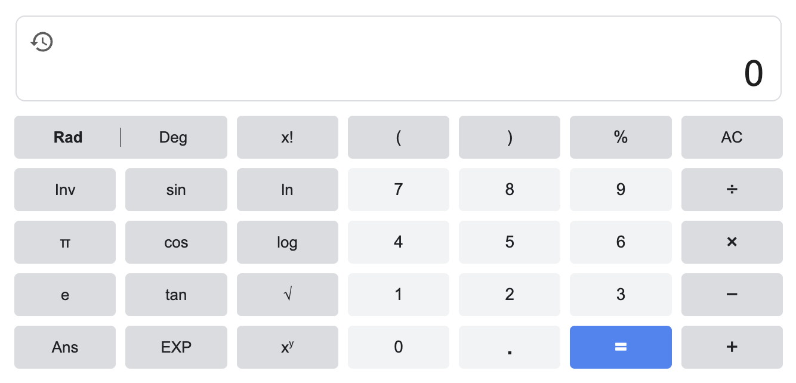

```{r setup, include=FALSE}
knitr::opts_chunk$set(echo = TRUE, fig.align = 'center', fig.width=7, fig.height=5, message = TRUE, warning = TRUE)
library(kableExtra)
```


# Installer R

1. On install d'abord le noyau de R. Voici les liens vers les installation pour differents système d'exploitation: 
  * [Windows](https://cloud.r-project.org/bin/windows/base/R-4.4.1-win.exe), 
  * [macOS: Apple silicon (M1-3)](https://cloud.r-project.org/bin/macosx/big-sur-arm64/base/R-4.4.1-arm64.pkg)
  * [macOS: Intel](https://cloud.r-project.org/bin/macosx/big-sur-x86_64/base/R-4.4.1-x86_64.pkg)
  * et pour Linux [Debian, Fedora/Redhat, Ubuntu](https://cloud.r-project.org/bin/linux/)
2. Install l'interface la plus utilisée, Rstudio pour :
  * [Windows](https://download1.rstudio.org/electron/windows/RStudio-2024.09.0-375.exe)
  * [macOS](https://download1.rstudio.org/electron/macos/RStudio-2024.09.0-375.dmg) 
  * [Ubuntu 20/Debian 11](https://download1.rstudio.org/electron/focal/amd64/rstudio-2024.09.0-375-amd64.deb)
  * [Ubuntu 22/Debian 12](https://download1.rstudio.org/electron/jammy/amd64/rstudio-2024.09.0-375-amd64.deb)
  * [Ubuntu 24](https://download1.rstudio.org/electron/jammy/amd64/rstudio-2024.09.0-375-amd64.deb)

# Les operateurs 
R est une calculatrice du fait qu'on peut effectuer toute les opérations dans la console de R.
```{r echo=FALSE, fig0001, fig.align='center'}

```

## Arithmetic Operators
###  L'addition: `+`
```{r echo=TRUE}
1+1
```

###  La soustraction: `-`
```{r echo=TRUE}
1-1
```

### La multiplication: `*`
```{r echo=TRUE}
1*1
```

### Division: `/`
```{r echo=TRUE}
1/1
```

### Modulo (rest d'une division entre deux nombres) : `%%`
```{r echo=TRUE}
1 %% 2
```


### Exponentiel : `^` or `**`
```{r echo=TRUE}
2 ^ 10 # or 2 ** 10
```

### Division entière : `%/%`

```{r echo=TRUE}
1035 %/% 3
```


## Les opérateurs logiques

### Strictement inférieur : `<`
```{r echo=TRUE}
1 < 1
```

### Inférieur ou égal à : `<=`
```{r echo=TRUE}
1 <= 1
```

### Strictement supérieur à : `>`
```{r echo=TRUE}
1 > 1
```

### Supérieur ou égal à : `>=`
```{r echo=TRUE}
1 >= 1
```
### Exactement égal à : `==`
```{r echo=TRUE}
"R" == "r"
```

\textcolor{red}{R est sensible à la casse !!!}

### Not equal to: `!=`
```{r echo=TRUE}
1 != 1
```

### Négation/NON: `!`
Utiliser pour changer une proposition fausse en vraie (ou vraie en fausse)
```{r echo=TRUE}
!TRUE # or !T
```

### AND: `&`
```{r echo=TRUE}
TRUE & TRUE
TRUE & FALSE
FALSE & FALSE
```

### OR: `|`
```{r echo=TRUE}
TRUE | TRUE
TRUE | FALSE
FALSE | FALSE
```

# R object and assignment

In R we can use `<-`, `=` (single equal sign !) and `->` to assign a value to a variable. 

A variable name:

* can begin with a character or dot(s). Ex: `a <- 1`, `0 -> .a` 
* should not contain space. Replace empty space with `_`.
```{r echo=TRUE, error=TRUE}
v rsion <- 4.3.2
```

* can contain numbers. Ex: `a1 <- 1`.

```{r echo=TRUE}
a <- 1
0 -> .a
a1 = .a
```


## Data types
In R we have the following data types:
* numeric
* integer
* complex
* character
* logical
* raw
* factor

### Numeric - (10.5, 55, 787)
```{r echo=TRUE}
PI <- pi; class(PI); typeof(PI)
n <- 55; class(n); typeof(n)
```

###  Integer 
* (1L, 55L, 100L, where the letter "L" declares this as an integer).
* Check the class of n <- 55L. What do you see?


### Complex - (9 + 3i, where "i" is the imaginary part)
```{r echo=TRUE}
z <- 9 + 3i; class(z); #typeof(z)
```

###  Character/string
```{r echo=TRUE}
string <- "Learning"; class(string)
```

Remember!! `LeaRning` is different from `Learning`.

### Logical/Boolean - (TRUE or FALSE)
```{r echo=TRUE}
TRUE # or T
FALSE # or F
```

Logical output can also be an outcome of a test. Example: if we want to check if  `"LeaRning" == "Learning"`

```{r}
"LeaRning" == "Learning"
```
### Raw
```{r}
text <- "I am learning R."
(raw_text <- charToRaw(text))
class(raw_text)
```

Converting raw to text:

```{r}
rawToChar(raw_text)
```

### Factors
They are a data type that is used to refer to a qualitative relationship like colors, good & bad, course or movie ratings, etc. They are useful in statistical modeling.
```{r}
Gender <- factor(c("Female", "Male"))
print(Gender)
class(Gender)
```


## R Data Structures

The most used data types in R are 

* Vectors
* Lists
* Matrices
* Arrays
* Factors
* Data Frames

### Scalars and vectors: 

* A scalar is any number in N, Z, D, Q, R, or C (Quantum Mecanics)
* Vectors: collection of identical objects of the same type. A vector can also be a sequence;


Example 1:
```{r echo=TRUE}
v <- c(1, "R", T, FALSE, NA)
# print v
# what is the class of v?
# sequence
x <- seq(0, 2*pi, length.out = 50)
head(x, 10)
```
A scalar is a vector of length 1.

Example 2:
```{r echo=TRUE}
# repetition
rep(c(0:1), c(50, 50))
# sampling
sample(0:1, size = 100, replace = TRUE, prob = c(0.5, 0.5)) -> y
y
sum(y == 0); sum(!y == 1)
```

### Matrices: 
Matrices are two dimensional data set with columns and rows.
```{r echo=TRUE}
(A <- matrix(1:25, ncol = 5)) # byrow = F by default
(B <- matrix(1:25, nrow = 5, ncol = 5, byrow = T)) # ncol = 5 is optional.
```

#### Matrix definition

```{r echo=TRUE}
(A <- matrix(c(1, 0, 2, 5, 2, 1, 4, 2, 0), nrow = 3))
(B <- matrix(c(2, 5, 2, 3, 1, 1, 0, 1, 1), nrow = 3))
```

#### Matrix from vectors
We can also construct a matrix from vectors $M = (v_1, v_2, v_3)$ using the `cbind` and `rbind` functions.
```{r echo=TRUE}
v1 <- c(1, 0, 2); v2 <- c(5, 2, 1); v3 <- c(4, 2, 0)
(M1 <- cbind(v1, v2, v3))
(M2 <- rbind(v1, v2, v3))
class(M1)
class(M2)
```

#### Matrix using `dim` function
! `dim` is also called to check the dimension of a matrix, a data frame or an array.
```{r echo=TRUE}
M3 <- c(1, 5, 4, 0, 2, 2, 2, 1, 0)
dim(M3) <- c(3, 3) # sets the dimensions of M3
dim(M3) # shows the dimensions of M3
M3
class(M3);
```

#### Matrix operations
* Transpose
```{r echo=TRUE}
(A_T <- t(A))
```

* Addition
```{r echo=TRUE}
A + B
```

* Substraction
```{r echo=TRUE}
A - B
```

* Multiplication
```{r echo=TRUE}
# number of columns in A: dim(A)[2], or ncol(A).
# number of rows in A: dim(A)[1], or nrow(A)
dim(A)[2] == ncol(A)
ncol(A) == nrow(B)
A %*% B
```

* Inverse
```{r echo=TRUE}
# I want to get the inverse of A
(A_inv <- solve(A))
A %*% A_inv # is to check if A_inv is really the inverse of A.
```

#### Solving a system of equations

$$
\begin{cases}
2x + 2y &= 4\\
x + 3y &= 4
\end{cases}
$$
The matrix of the equation system is: 
$\displaystyle A = \begin{pmatrix}2&2\\1&3\end{pmatrix}$ and the right hand side of the equation is $b = \begin{pmatrix}4\\4\end{pmatrix}$. We can use the `solve` function to have the solutions.
```{r echo=TRUE}
A1 <- matrix(c(2, 2, 1, 3), nrow = 2, byrow = TRUE)
b <- c(4, 4)
solve(A1, b)
# A1*A1 # point-wise multiplication.
```
* Division: multiply a matrix by the inverse of another. $B/A = BA^{-1}$
```{r echo=TRUE}
B %*% A_inv
```


#### Eigen values/vectors (basis of [Principal Component Analysis](https://www.datacamp.com/tutorial/pca-analysis-r))

Requirements:

* `A` should be a square matrix of dimension $n$.
* The eigen values $\lambda$ are solutions of the characteristic polynomial

$$
P_A(\lambda) = \det(A-\lambda I_n) = 0,\quad n\in \mathbb{N}.
$$

#### Eigen values/vectors
```{r echo=TRUE}
ev <- eigen(A)  # gives a list of eigen values and
                # eigen vectors
ev$values
is.list(ev)
ev$vectors
```


### Arrays
Arrays are data type with more than two dimensions
```{r echo=TRUE}
(aRray <- array(1:24, dim = c(3, 4, 2)))
```

```{r echo=TRUE}
class(aRray)
```
An example of array is NetCDF data with for instance:
* Longitude as column names ($n$)
* Latitude as row names ($p$)
* 3rd dimension could the time. For each time, we have a $n\times p$ matrix.

```{r echo=TRUE}
dim(aRray)
aRray[1, 1, 2] # element at i=1, j=1 from the second matrix
```

The dimension: row position, column position, matrix level

### Lists
A list is a collection of object of different types. The sizes of elements could be different.
```{r echo=TRUE}
mylist <- list("matrix" = A, 
               "sequence" = x,
               "Bool" = TRUE, 
               "Array" = aRray)

mylist$matrix
```


#### Accessing elements of a list
```{r echo=TRUE}
class(mylist[[1]])
mylist$Array
```

#### Accessing elements of a list
```{r echo=TRUE}
mylist[c("Array", "matrix")]
```

### Data Frames
A data frame is a table of $n$ number of rows (observations) and $p$ number of columns (features or variables). Variables can take any data type.


### Factors

### Converting a continuous variable into a categorical variable
```{r echo=TRUE}
set.seed(12092024)
age <- sample(0:120, size = 100)
(brks <- seq(0, 120, by = 10))
# (brks <- seq(min(age), max(age), le = 40))
age_groups <- cut(age, breaks = brks, include.lowest = TRUE)
class(age_groups)
```


```{r echo=TRUE}
table(age_groups)
# checking for missing values
(which(is.na(age_groups)) -> id_missing)
# convertion
age_factor <- factor(age_groups) # not necessary!
```


```{r echo=TRUE}
identical(age_groups, age_factor)

# count in each class/group
frequencies <- table(age_groups)
```


### Data frames
A data frame a is also a list where all elements (columns) have the same length. A data frame in R is a table.

```{r echo=TRUE}
# converting a list into a dataframe
```

#### Create a data frame using the `data.frame()` function
```{r echo=TRUE}
df2 <- data.frame(x = rnorm(10), y = rpois(10, 2))
head(df2)
```


#### Data manipulation
* Missing values (`NA`)
```{r}
x <- c(NA, 1, 2, NA, 3, NA, 3.55)
which(is.na(x)) # means: which of the elements of x are missing
which(x >= 2) # means: which of the elements of x are greater than or
              # equal to 2.
# which(x != NA) wrong way to check for non-missing values
which(!is.na(x)) # means: which of the elements of x are not missing

mis_id <- which(is.na(x))
x[mis_id]
x[is.na(x)] <- mean(x[which(!is.na(x))]) # Good but could be shorter
x[is.na(x)] <- mean(x, na.rm = TRUE)

print(x)
```

* NAs introduced by coercion when converting strings to numeric
```{r echo=TRUE}
x <- c(2, 1, 2, 7, 3, 2.5, 9, "2,7")
class(x)

# converting into numeric
z <- as.numeric(x)
x[which(is.na(z))] <- 2.7
z[which(is.na(z))] <- 2.7
z; x
```

* Outliers detection

#### Plots from a data frame
```{r echo=TRUE, fig17, fig.height=3, fig.width=7}

```


# Data simulation and visualization

## Charts in R
### Bar chart/plot
```{r echo=TRUE, figo0, fig.height=4, fig.width=8}
barplot(frequencies, cex.names=0.6) # use horiz = TRUE to have horizontal bars
```

The argument `cex.names` reduces the size of x-labels. Low values, say `cex.names=0.6`, forces R to show all the labels.

* Number of observations in a subset: $\displaystyle\sum_{i=1}^nI_{\{\textrm{age}_i\geq80\}}$
* Percentage of observations in a subset: $\displaystyle\frac{100}{n}\sum_{i=1}^nI_{\{\textrm{age}_i\geq80\}}$
* $n$ is the sample size.
```{r echo=TRUE}
sum(age >= 80) 
mean(age >= 80) # I get the relative frequency
```

### Pie chart/plot
```{r echo=TRUE}
pie(c(30, 50, 20), col = 1:3)
```

### Histograms
```{r echo=TRUE}
set.seed(12092024)
x <- sample(1:120, size = 1000, replace = TRUE); 
hist(x, probability = TRUE) # use probability = TRUE to have densities 
        # instead of counts (frequencies)
# Density plots
plot(density(x))
```

### Scatter plot
```{r}
x <- seq(0, 2*pi, le = 50)
y <- sin(x)
z <- cos(x)
tg <- tan(x)
plot(x, y, pch = 16, col = "blue")
```


## Distribution simulations

### Uniform distribution
```{r echo=TRUE}
set.seed(13092024)
unif_dist <- runif(1000)
hist(unif_dist, probability = TRUE, xlab = NULL,
     main = "Histogram of uniform distribution", col = "turquoise")
lines(density(unif_dist), col = "red", lwd = 2, lty = 2)
abline(v = mean(unif_dist), col = "blue", lty = 2, lwd = 2)
legend("topleft", lty = c(2, 2), 
       col = c("red", "blue"), legend = c("Density", "Average"))
```

### Binomial distribution
```{r echo=TRUE}
rbinom_dist <- rbinom(10000, 10, 0.5)
hist(rbinom_dist, probability = TRUE, main = "Histogram of binomial distribution", 
     col = "turquoise", breaks = 20, xlab = NULL)
lines(density(rbinom_dist), col = "red", lwd = 2, lty = 2)
abline(v = mean(rbinom_dist), col = "blue", lty = 2, lwd = 2) # vertical line
legend("topleft", lty = c(2, 2), 
       col = c("red", "blue"), legend = c("Density", "Average"))
```

### Gaussian distribution
```{r echo = TRUE}
set.seed(13092024)
gauss_dist <- rnorm(1000, mean = 0, sd = 1)
hist(gauss_dist, probability = TRUE, breaks = 30, xlab = NULL,
     main = "Histogram of standard normal\ndistribution", col = "turquoise")
lines(density(gauss_dist), col = "red", lwd = 2, lty = 2)
abline(v = mean(gauss_dist), col = "blue", lty = 2, lwd = 2)
legend("topleft", lty = c(2, 2), 
       col = c("red", "blue"), legend = c("Density", "Average"))
```

### Scatter plot to show relationship between two variables
```{r echo=TRUE}
set.seed(13092024)
x <- rnorm(1000); y <- rnorm(1000, mean = 5, sd = 1.5)
z <- 4 + 8*x + rnorm(1000) # linear dependence between x and z
par(mfrow = c(1, 2))
plot(x, y, main = "Scatter plot of x and y", col = "blue", pch = 16); grid()
plot(x, z, main = "Scatter plot of x and z", col = "blue", pch = 16)
```

### Exponential distribution
```{r echo=TRUE}
set.seed(13092024)
exp_dist <- rexp(1000, rate = 1)
hist(exp_dist, probability = TRUE, xlab = NULL, 
     main = "Histogram of exponential distribution", col = "turquoise")
lines(density(exp_dist), col = "red", lwd = 2, lty = 2)
abline(v = mean(exp_dist), col = "blue", lty = 2, lwd = 2)
legend("topright", lty = c(2, 2), 
       col = c("red", "blue"), legend = c("Density", "Average"))
```

### Poisson distribution
```{r echo=TRUE}
set.seed(13092024)
pois_dist <- rpois(1000, lambda = 2.5)
hist(pois_dist, probability = TRUE, main = "Histogram of poisson distribution", 
     col = "turquoise", xlab = NULL)
lines(density(pois_dist), col = "red", lwd = 2, lty = 2)
abline(v = mean(pois_dist), col = "blue", lty = 2, lwd = 2)
legend("topright", lty = c(2, 2), 
       col = c("red", "blue"), legend = c("Density", "Average"))
```

# Flow Controls: 

## `if` / `else`

```
if (condition/Boolean expression){
  ## code to be executed
}
```

### Example
```{r echo=TRUE}
x <- 3

if (x < 4){
  print(TRUE)
} else {
  print(FALSE)
}

# one line
ifelse(x < 4, T, F)
```

We can embed `if` to `if` and `else`.
```{r echo=TRUE}
if (x < 4){
  if (x != 0){
    print("x is not equal to zero.")
  } else {
    print("x is equal to zero")
  }
  
  print("x is less than 4")
} else {
  if (x > 1){
    print("x is greater than 1.")
  } else {
    print("x is less than or equal to 1")
  }
  print("x is greater than 4.")
}
```


## Loops 

* for loops

```
for (i in vector){
  ## code to be executed
}
```

```{r echo=TRUE}
m <- 6
for (i in 1:m) print(i)
```


```{r echo=TRUE}
for (i in 1:m) {
  print(i)
}
```

### Exercise 1:
Write a for loop that checks each of the first 10 positive integers if it is odd or even.
```{r echo=TRUE}
## TODO
```


### Exercise 2: 
Using `for loop`, import all `CSV` from the `data_files` folder.
```{r}
# checking the working directory
getwd()
# simple ls like in bash
dir()
dir("./data_list/", pattern = ".csv") # list of elements of in a directory
# Exercise: write a for loop to import all
# csv files in a list.
(file_names <- dir("./data_list/", pattern = ".csv"))
```

**Hints:** Importing files from the working directory

* We need a path/url when the file to be loaded is not in the working directory.
* We construct a path by combining strings. See the example below.

```{r echo=TRUE}
string1 <- "." # working directory (root where the script is saved)
string2 <- "folder" # folder in the working directory
string3 <- "subfolder" # sub-folder in folder
paste(string1, string2, string3, sep = "/")
paste0(string1, "/", string2, "/", string3)
```

### Importing files from a folder located in my working directory
```{r echo=TRUE}

```


## while
```
while (condition){
  ## code to be executed
  
  # increment
}
```

```{r echo=TRUE}
# Initialize i
i <- 0
while (i <= 10) {
  print(i*2)
  
  i <- i+10
}
```


## Exercises

1. Write a program that will tell the user YOU WON! and exit if they get 5 three times on a row.
```{r echo=TRUE}

```


2. Write a program that run continuously an ask a user to input a number between 0 and 9 and provide the multiplication table by 2 and asks the user to stop or continue.

**Hint:** Use the function `readline(prompt = "Enter a number: ")` to interact with the user.

```
number <- readline(prompt = "Entrer un nombre: ") # conversion is needed.
```


## repeat

Syntax of the repeat loop:

```
# increment i or anything else
i <- 0

repeat{
  # execute a code
  
  # increment
  i <- i + 1
  
  # stopping criteria
  if ( something happens ){
    break # repeat until something happens
  }
}
```


```{r echo=TRUE}
i <- 0
repeat{
  print(i)
  i <- i + 1
  if (i > 10) break # repeat until condition holds.
}
```

# Apply Functions Over Array Margins

## `apply`
The `apply()` function return a vector or array or list of values obtained by applying a function to margins of an array or matrix.

```{r echo=TRUE}
A <- c(1:4)
dim(A) <- c(2, 2)
A

avg <- function(x){
  sum(x)/length(x)
}

v <- 1:10

avg(x = v)
```


```{r echo=TRUE}
# iris[-5]
apply(iris[-5], MARGIN = 2, summary)#/nrow(iris[-5]) # MARGIN = 2 means column-wise
```

## `sapply`: use `?sapply` to check the documentation.
```{r echo=TRUE}
sapply(A, sum) # does not apply for matrices
```


The `sapply` function can also return a list if the outputs are not of the same length.
```{r echo=TRUE}
sapply(iris, summary)
```


```{r echo=TRUE}
df <- data.frame(replicate(10, rnorm(1000)))
L <- as.list(df) # converting data frame to list.
sapply(L, avg)
```

```{r echo=TRUE}
sapply(1:10, function(x) x^2)
```

## `lapply`: 
The `lapply()` function returns a list of the same length as X, each element of which is the result of applying FUN to the corresponding element of X
```{r echo=TRUE}
a <- lapply(iris[-5], mean) # MARGIN = 2 means column-wise
write.csv(a, "a.csv")
unlist(a)
```

## `tapply`: check the documentation using `?tapply`

```{r echo=TRUE}
is.factor(iris$Species) # checking if the column named Species is a factor.
tapply(iris$Sepal.Length, iris[[5]], mean)
```

## `vapply`: check the documentation

```{r echo=TRUE}
vapply(X = as.list(iris[-5]), quantile, FUN.VALUE =
       c("0%" = 0, "25%" = 0, "50%" = 0, "75%" = 0, "100%" = 0))
```


# Define functions in R

Syntax to write/define a function in R:

```
function_name <- function(arg1, arg2, ...){
  # code to be executed
}
```

```{r echo=TRUE}
pp <- function(x) return(x+1)
i <- 1
(i <- pp(i))
```
## Exercises
1. Write a function that takes an `x` as argument and detects NA then replaces them by the mean

```{r}
replace_missing <- function(x, fun){
  
}

replace_missing(x, fun = mean)
```


2. Draw the flowchart of the quadratic equation $ax^2+bx+c=0$ and write an R function that give solutions and comment according to the values of the discriminant.


# Packages
A package is a collection of data and functions with their documentations.
```{r echo=TRUE}
# install.packages("pacman", dependencies = TRUE)
# install.packages("ggplot2")
# rownames(installed.packages())
```


# Prenvent R from display warning when loading a packages

Do the following setting

```
{r warning=FALSE, message=FALSE}
```


```{r warning=FALSE, message=FALSE, echo=TRUE}
library(pacman)
source("mypackages.R")
```


# Import data in R

## Inbuilt data
The `iris` data set exist already in the R environment. 
We can import data in R from different sources:

## from a package without loading it using the `library` function.
```{r echo=TRUE}
data("spam", package = "kernlab")
# data structure
str(spam[1:10])
```


* Comma Separated Value file

Exercise: import all the csv files in a list using a for loop. 
```{r echo=TRUE}
data_list <- list() # creating an empty list.
dir()
# check the files names in data/csv
dir("./data/csv/")
# import 
# TODO
```


# Pipe: `%>%` or `|>`

* Library: `tidyverse` or `dplyr` 
* Shortcut: `Crtl + Shift + M`
* Why is it useful?


```{r}
library(tidyverse)
```

```{r echo=TRUE}
iris %>% group_by(Species) %>% summarise(mean = mean(Petal.Width))
```
# Instead of
```{r echo=TRUE}
summarise(group_by(iris, Species), mean = mean(Petal.Width))
```


# Data manipulation

## Data manipulation with tidyverse
## Data manipulation with tibble
## Data manipulation with reshape2
```{r echo=TRUE, fig09887, fig.height=3, fig.width=8}
library(ggplot2)
iris %>% ggplot(aes(y = Petal.Length,  col = Species)) + geom_boxplot()
```


## Data display with kabbleExtra
## Data display with officer, ...
## Data visualization with ggplot2
```{r echo=TRUE, fig098876, fig.height=3, fig.width=8}
iris %>% 
  ggplot(aes(y = Petal.Length,  fill = Species)) + 
  geom_boxplot() + 
  facet_grid(~Species) + 
  theme_minimal()
```


* https://bookdown.org/ozancanozdemir/introduction-to-ggplot2/

## Data visualization with plotly


# R advanced

## Regular expressions
## Unsupervised & Supervised Learning
### Principal Component Analysis
### Clustering: K-means, Hierarchical Clustering
### K-Nearest Neighbor
### Simple Linear Regression
### Logistic Regression
## Machine Learning
## 


## Latex in Rstudio (R markdown/Quarto markdown)

The variance of a real-valued variables `$X = (X_1, \ldots, X_n)$` is given by:

The variance of a real-valued variables $X = (X_1, \ldots, X_n)$ is given by:

```
$$
\textrm{Var(X)} = 
\left[\frac{1}{n}\sum_{i=1}^n\left(X_i-\frac{1}{n}
\sum_{i=1}^nX_i\right)^2\right]^\frac{1}{2}
$$
```

$$
\textrm{Var(X)} = \left[\frac{1}{n}\sum_{i=1}^n\left(X_i-\frac{1}{n}\sum_{i=1}^nX_i\right)^2\right]^\frac{1}{2}
$$

# Include bash code in Rstudio
```{bash echo=TRUE}
#!/bin/bash
for ((i=1; i<=10; i++)); do
  echo $i
done
```

